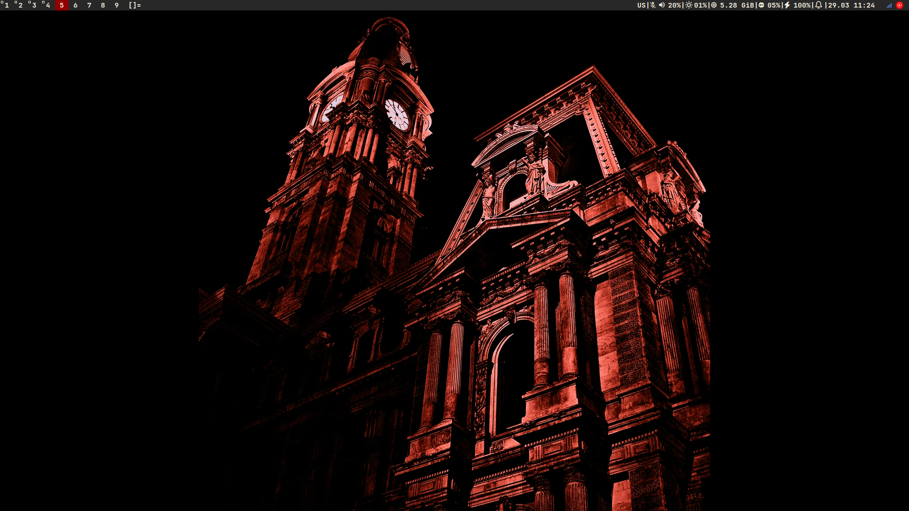
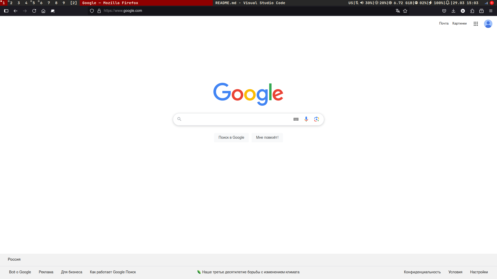
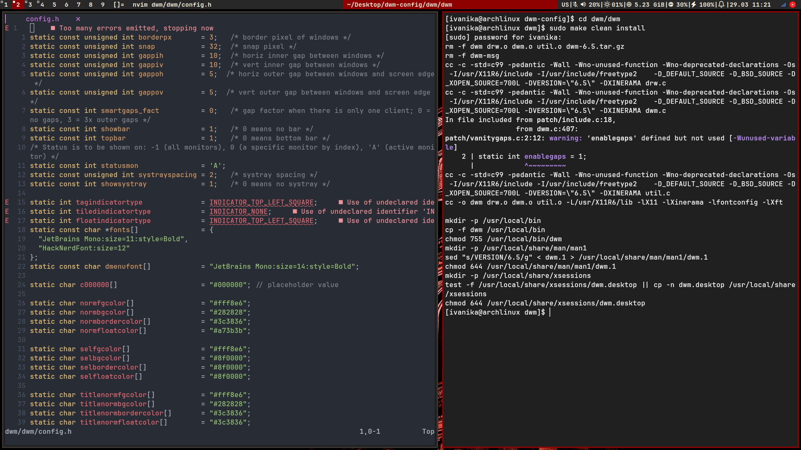
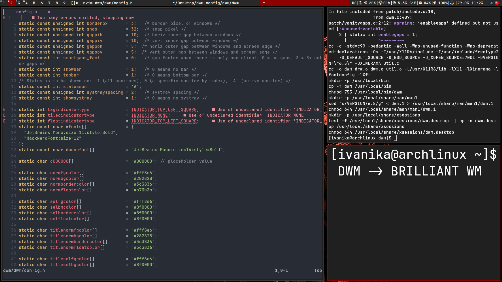
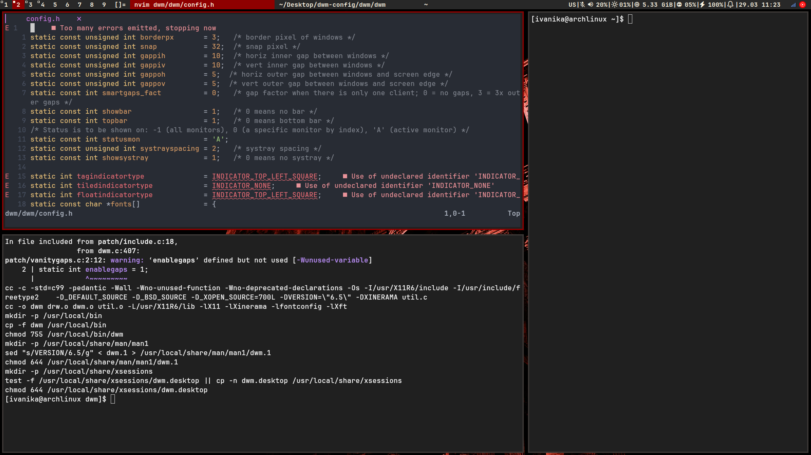

<details>
<summary><b>SCREENSHOTS</b></summary>







</details>

---
## Installation

> Currently, the commands are only relevant for **`Arch-based`** distributions

<details>
<summary>Required packages for proper operation</summary>

For Arch/Arch-based systems:

- thunar
- feh
- alsa
- pipewire
- pipewire-alsa
- pipewire-audio
- pipewire-pulse
- wireplumber
- acpi
- dunst
- brightnessctl
- picom (optional)

</details>

### Use the following commands to install

On Arch / Arch-based : 
```bash
sudo pacman -Sy thunar feh pipewire pipewire-alsa pipewire-audio pipewire-pulse wireplumber acpi dunst brightnessctl fastfetch
```

### Repository cloning and compilation
```bash
git clone https://github.com/1van1ka/dwm-config.git ~/dwm-tmp
cd ~/dwm-tmp
rm README.md && rm -rf screenshots/

cp -RT . ~/.config/

cd ~/.config/dwm/dwm
make && sudo make install
sudo cp startdwm.sh /usr/local/bin/

cd ../dwmblocks/
make && sudo make install

cd ../dmenu/
make && sudo make install

rm -rf ~/dwm-tmp
```


### Boot configuration

If using a display manager

```bash
sudo cp ~/.config/dwm/dwm/dwm.desktop /usr/local/share/xsessions/
```
If not using a display manager
```bash
echo "exec /usr/local/bin/startdwm.sh" >> ~/.xinitrc
```
